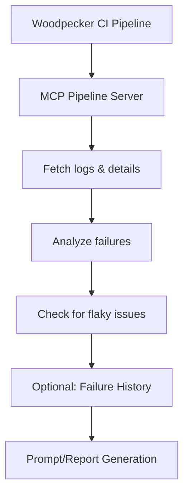

[](https://mseep.ai/app/93f8398c-7a46-4213-8e74-56600b2f7aeb)

# MCP Pipeline Server

## Overview & Goal
The MCP Pipeline Server automates the analysis and reporting of CI pipeline failures, focusing on Woodpecker CI. Its main goals are:
- Collect pipeline logs and failure details
- Analyze failed workflow steps (with retry awareness)
- Track flaky or recurring failures
- Provide prompt-driven diagnosis and reporting for developers

## Flow Overview


**Flow Steps:**
1. Woodpecker CI triggers a pipeline.
2. MCP Pipeline Server fetches logs and details.
3. The server analyzes failures (last attempt only).
4. Prompt/Report is generated for developers.

## How It Works
1. **User provides repoId and pipelineNumber** (from Woodpecker CI URLs)
2. **Server fetches logs and failure details**
3. **Prompt logic** (see `src/prompts/CiPipelinePrompt.ts`) guides the analysis:
   - Only the last attempt of each failed step is considered
   - Checks for recurring issues using historical data from Google Sheets
   - Generates a report and suggestions

## Setup Instructions
1. **Install dependencies**
   ```bash
   pnpm install
   # or
   npm install
   ```
2. **Build the project**
   ```bash
   pnpm run build
   # or
   npm run build
   ```
3. **Start the server**
   ```bash
   pnpm start
   # or
   npm start
   ```

## Example MCP Client Config
This is how a client might configure MCP to use this server:
```json
{
  "servers": {
    "ci-pipeline-tool": {
      "command": {
        "type": "stdio",
        "command": "npx",
        "args": [
           "-y",
           "woodpecker-ci-mcp@0.0.2"
         ], 
         "env": {
          "WOODPECKER_TOKEN": "<your-woodpecker-token>",
          "WOODPECKER_SERVER": "https://woodpecker.orgName.dev/api"
        }
      }
    }
  }
}
```

## Extracting repoId and pipelineNumber
- **repoId**: Use regex `/\/repos\/([^/]+)/` on Woodpecker CI URLs
- **pipelineNumber**: Use regex `/\/pipeline\/([^/]+)/`
  Example: For `https://woodpecker.orgName.dev/repos/1/pipeline/1`, repoId=`1`, pipelineNumber=`1`