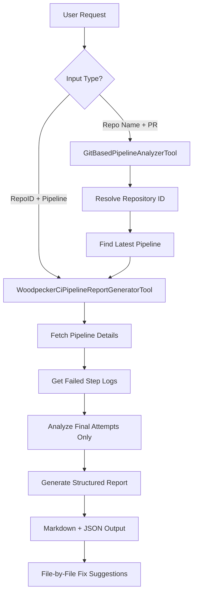

[](https://mseep.ai/app/93f8398c-7a46-4213-8e74-56600b2f7aeb)

# MCP Pipeline Server

A Model Context Protocol (MCP) server for automated CI/CD pipeline failure analysis, specifically designed for Woodpecker CI integration with IDE support.

## 🚀 Overview

The MCP Pipeline Server provides intelligent CI pipeline failure analysis with two flexible approaches:
- **Direct Pipeline Analysis**: Analyze specific pipelines using repository ID and pipeline number
- **Git-Context Analysis**: Automatically resolve and analyze pipelines using repository name, PR number, or branch information from your IDE

## 🛠️ Available Tools

### 1. WoodpeckerCiPipelineReportGeneratorTool
**Purpose**: Direct pipeline analysis with specific identifiers
**Input**: 
- `repoId`: Woodpecker CI repository ID (e.g., "1")
- `pipelineNumber`: Specific pipeline number (e.g., "100577")

**Usage**:
```bash
# Example URLs to extract info from:
# https://woodpecker.orgName.dev/repos/1/pipeline/100577
# repoId = "1", pipelineNumber = "100577"
```

### 2. GitBasedPipelineAnalyzerTool
**Purpose**: Intelligent pipeline analysis using git context from IDE
**Input**:
- `repoName`: Repository name (e.g., "my-project")
- `pullRequestNumber`: PR number (e.g., "123") 
- `branchName`: Git branch name (optional)

**Features**:
- Auto-resolves repository ID from name
- Finds latest pipeline for the specified PR
- Handles running pipelines gracefully
- Integrates with IDE git context

## 📋 Available Prompts

### 1. analyze-pipeline
**Purpose**: Traditional pipeline analysis with specific repo/pipeline numbers
**Best for**: Direct analysis when you have Woodpecker CI URLs

### 2. analyze-pr-failures  
**Purpose**: IDE-integrated analysis using git context
**Best for**: Analyzing PR failures directly from your development environment

## 🔄 Analysis Flow



## 🏗️ Architecture

### Dependency Injection System
The server uses a NestJS-style dependency injection pattern:

```typescript
// Services are auto-registered with @Injectable()
@Injectable()
class WoodpeckerForgesService {
    // Service implementation
}

// Tools inject services via constructor
export class GitBasedPipelineAnalyzerTool extends MCPTool<Input> {
    constructor(
        private woodpeckerForges: WoodpeckerForgesService = inject('WoodpeckerForgesService')
    ) {
        super();
    }
}
```

### Caching Strategy
- **Repository Resolution**: 24-hour cache for repo name → repo ID mappings
- **Pipeline Analysis**: 2-hour cache for complete pipeline analysis results
- **No Pipeline Resolution Cache**: Always fetches latest pipeline to avoid stale data

### Service Lifecycle
1. **Startup**: ServiceManager initializes and discovers @Injectable services
2. **Runtime**: Lazy service instantiation on first use
3. **Shutdown**: Proper cache cleanup and resource disposal

## 🚦 Usage Examples

### IDE Integration (Recommended)
```bash
# Analyze current PR failures
"Analyze PR failures for #123"

# Analyze by repository name
"Check CI issues for my-project repository"

# Analyze specific branch
"Analyze failures on feature/new-ui branch"

# Context-aware analysis
"Review CI problems"  # Uses current git context
```

### Direct Pipeline Analysis
```bash
# Using specific Woodpecker CI identifiers
woodpecker-ci-pipeline-report-generator --repoId="1" --pipelineNumber="100577"
```

## 📊 Output Format

### Human-Readable Report
```markdown
## CI Failure Analysis – pipeline #100577 | repo: my-project | PR #123
| # | Scenario | Scenario File | Code File | Failure Type | Brief Cause | Proposed Fix |
|---|----------|---------------|-----------|--------------|-------------|--------------|
| 1 | Login Flow | features/login.feature:23 | src/auth.js:45 | assertion | Element not found | Update selector |

### Details
#### Login Flow Test Failure
```log
Key failure indicators...
```
*Scenario file*: features/login.feature:23
*Root cause*: Updated UI element selector not matching
*Fix suggestions*: Update element selector in auth.js
```

### Machine-Readable JSON
```json
{
  "pipeline": "100577",
  "repoId": "1", 
  "context": {
    "repoName": "my-project",
    "prNumber": "123"
  },
  "analysedAt": "2024-08-11T10:30:00Z",
  "failures": [
    {
      "scenario": "Login Flow",
      "scenarioFile": "features/login.feature:23",
      "failureType": "assertion",
      "rootIndicators": ["Element not found", "Timeout"],
      "proposedFix": "Update element selector",
      "relatedFiles": ["src/auth.js:45"]
    }
  ]
}
```

## 🔧 Setup & Installation

### Prerequisites
- Node.js 18+
- pnpm or npm
- Access to Woodpecker CI instance

### Environment Variables
```bash
WOODPECKER_SERVER=https://woodpecker.your-domain.com
WOODPECKER_TOKEN=your_woodpecker_token
```

### Installation

#### Option 1: Install from npm (Recommended)
```bash
# Install globally
npm install -g woodpecker-ci-mcp

# Or install locally in your project
npm install woodpecker-ci-mcp
```

#### Option 2: Local Development
```bash
# Clone and install
git clone <repository-url>
cd mcp-pipeline-server
pnpm install

# Build
pnpm run build

# Start
pnpm start
```

### MCP Client Integration

#### Using the published package:
```json
{
  "mcpServers": {
    "woodpecker-ci": {
      "command": "npx",
      "args": ["woodpecker-ci-mcp"],
      "env": {
        "WOODPECKER_SERVER": "https://woodpecker.your-domain.com",
        "WOODPECKER_TOKEN": "your_token"
      }
    }
  }
}
```

#### Using global installation:
```json
{
  "mcpServers": {
    "woodpecker-ci": {
      "command": "woodpecker-ci-mcp",
      "env": {
        "WOODPECKER_SERVER": "https://woodpecker.your-domain.com",
        "WOODPECKER_TOKEN": "your_token"
      }
    }
  }
}
```

#### Using local build:
```json
{
  "mcpServers": {
    "woodpecker-ci": {
      "command": "node",
      "args": ["path/to/mcp-pipeline-server/dist/index.js"],
      "env": {
        "WOODPECKER_SERVER": "https://woodpecker.your-domain.com",
        "WOODPECKER_TOKEN": "your_token"
      }
    }
  }
}
```

## 🎯 Key Features

### Intelligent Analysis
- **Final Attempt Focus**: Only analyzes the last retry of failed steps
- **Pattern Recognition**: Identifies recurring failure patterns  
- **Context-Aware**: Understands git workflow and PR context

### IDE Integration
- **Automatic Repository Resolution**: No need to lookup repo IDs manually
- **Branch-Aware**: Finds appropriate pipelines for current branch/PR
- **Real-time Status**: Handles running pipelines gracefully

### Developer Experience
- **File-Specific Suggestions**: Pinpoints exact files and line numbers
- **Interactive Fixes**: Prompts before applying any changes
- **Structured Output**: Both human and machine-readable formats

### Performance
- **Smart Caching**: Optimized cache strategy for different data types
- **Lazy Loading**: Services instantiated only when needed
- **Resource Management**: Proper cleanup on shutdown

## 🔍 Troubleshooting

### Common Issues
1. **Service not found errors**: Ensure ServiceManager is initialized before tool usage
2. **Pipeline not found**: Verify repository name spelling and PR number
3. **Token issues**: Check WOODPECKER_TOKEN has sufficient permissions

### Debug Logging
The server provides detailed logging for service registration and pipeline resolution:
```
🔧 Service registered: WoodpeckerForgesService
Auto-registered services: WoodpeckerForgesService
```

## 🤝 Contributing

1. Follow the NestJS-style dependency injection patterns
2. Use `@Injectable()` for services that will be injected
3. Implement proper caching for external API calls
4. Add comprehensive error handling
5. Update this README for new tools/features

## 📚 API Reference

See individual tool files for detailed parameter schemas:
- `src/tools/WoodpeckerCiPipelineReportGeneratorTool.ts`
- `src/tools/GitBasedPipelineAnalyzerTool.ts`
- `src/prompts/CiPipelinePrompt.ts`
- `src/prompts/GitBasedCiAnalysisPrompt.ts`
